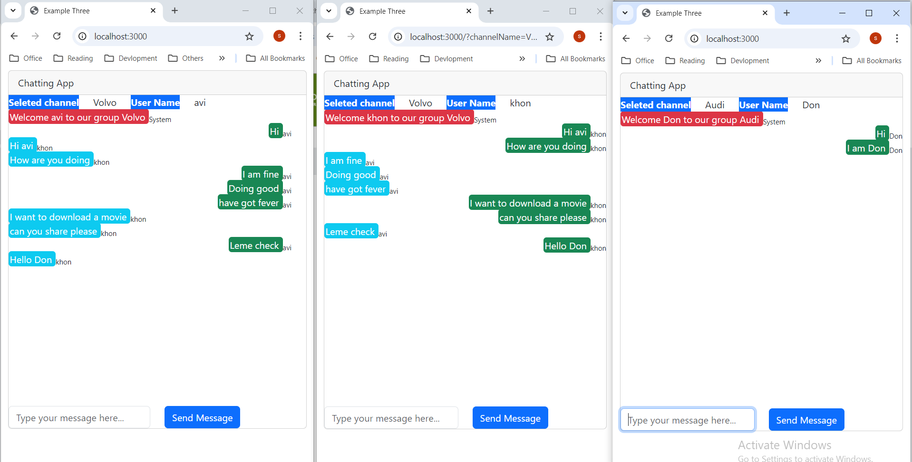

# basic-chat-app
basic-chat-app

This repo shows multiple chat examples with Websocket programming in NodeJS

# Example One
Many to Many chat message example

# Example Two
One to others chat message example

# Example Three
Channel chat, where one can chat to anyone joined in same channel but not in others

# Example Four
Channel chat, where one can chat to anyone joined in same channel but not in others
Also, will be able to see peoples joined in current channel

# Example Five
Will be allowed to switch channel in between & talk in another channel peoples & return back 
<b>Note:</b> Messages will be lost

# Example Five
Choose person and chat with him, one to one(select chat) or can select channel chat