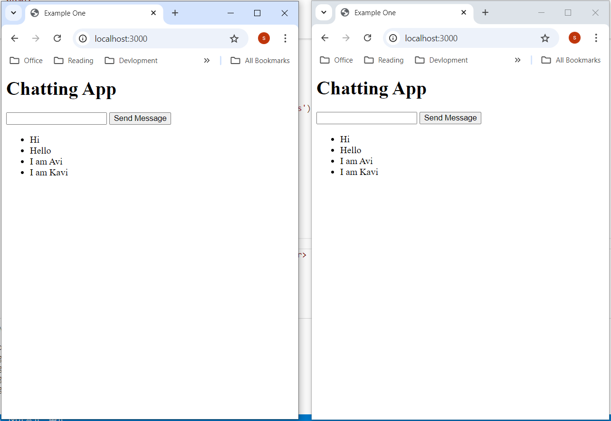
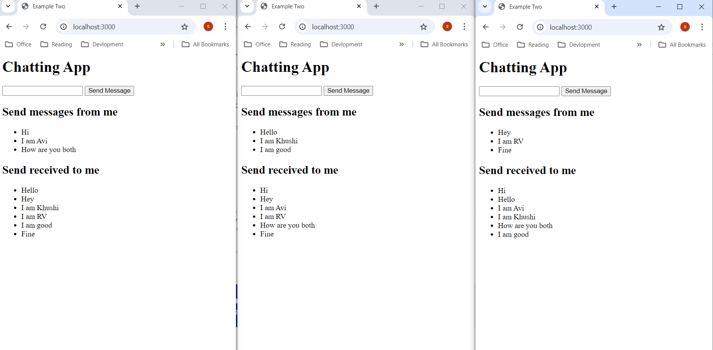

# basic-chat-app
basic-chat-app

This repo shows multiple chat examples with Websocket programming in NodeJS

# Example One
Many to Many chat message example

# Example Two
One to others chat message example

# Example Three
Channel chat, where one can chat to anyone joined in chat

# Example Four
Choose person and chat with him, one to one(select chat)